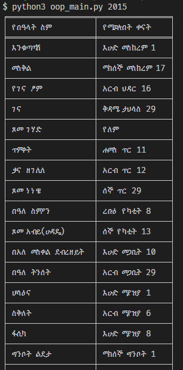
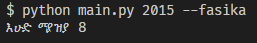

# :calendar: 𝕰𝖙𝖍𝖎𝖔𝖕𝖎𝖆𝖓 𝕱𝖊𝖘𝖙𝖎𝖛𝖆𝖑𝖘 𝕬𝖓𝖉 𝕳𝖔𝖑𝖎𝖉𝖆𝖞𝖘 𝕲𝖊𝖓𝖊𝖗𝖆𝖙𝖔𝖗:calendar:

- This is a python CLI program that generates the dates of main holidays of each year in ethiopian calendar.

## Features

- The program has two main features:

### 1. Prints a table of the holidays

- Assuming you are in the directory of the file `main.py`, you can enter the following command:

```sh
python3 main.py [year] -a
```

> or

```sh
python3 main.py -a
```

Example:

```sh
python3 main.py 2015 -a
```

> or you can just use the -a argument

```sh
python3 main.py -a
```

- The command will return a table like:

<p align="center">
  
</p>

### 2. Prints a date for a specific holiday

- Again, assuming you are in the directory of the file `main.py`, you can enter the following command:

```sh
python3 main.py [year] [Holiday argument]
```

> or

```sh
python3 main.py [Holiday argument]
```

Example:

```sh
python3 main.py 2015 --fasika
```

> or

```sh
python3 main.py --fasika
```

- The command will return:
<p align="center">
  
</p>

- Since there are multiple parameters for the holidays, you can run the following command for help

```sh
python3 main.py -h
```

### If you want to know how all the calculations were made:

[Click Here!](https://drive.google.com/file/d/1e7AukagokWlEiuz_0YtZ8Oz3RcUoQaLC/view?usp=sharing)

---

License: The repository is licensed under the MIT License.
